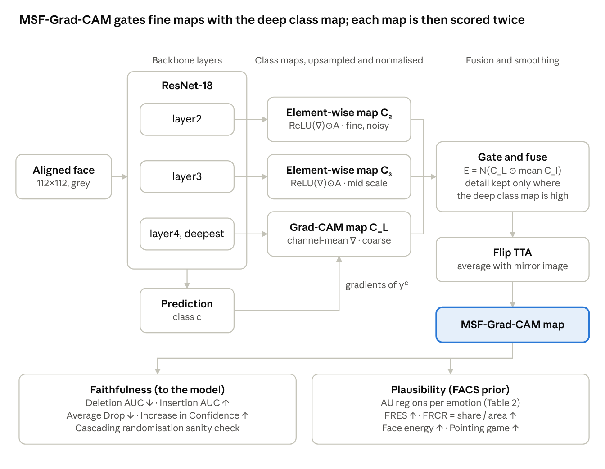
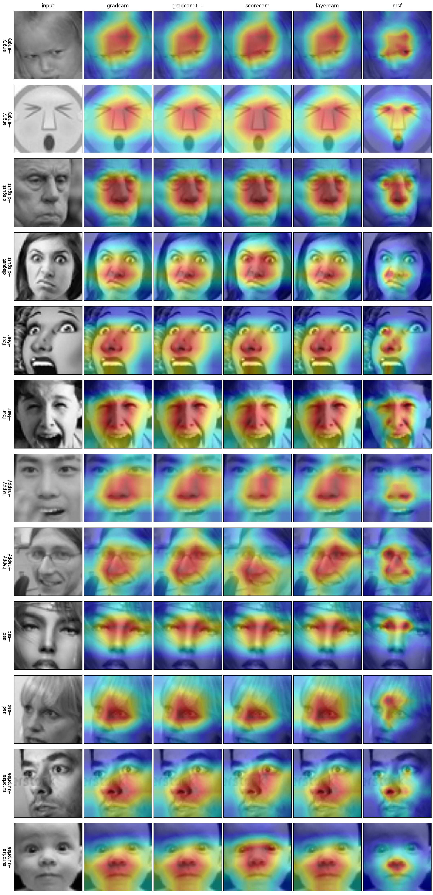

# Visualizing and Validating Deep Learning Models for Six Basic Facial Emotion Recognition Using Enhanced Grad-CAM

Code for training facial-emotion classifiers on the six basic emotions
(anger, disgust, fear, happiness, sadness, surprise) and for **explaining and
validating** their decisions with class-activation maps, including the proposed
**MSF-Grad-CAM** (Multi-Scale Fusion Grad-CAM).

<p align="center"></p>

## What is in this repository

| Part | File | What it does |
|---|---|---|
| Data | `src/data.py`, `scripts/prepare_csv.py`, `scripts/prepare_ckplus.py` | Folder or CSV datasets, six-class filtering, stratified / k-fold / subject-independent splits |
| Models | `src/models.py` | ResNet-18/50, VGG-16-BN, EfficientNet-B0, a small CNN |
| Explanations | `src/cams.py` | Grad-CAM, Grad-CAM++, XGrad-CAM, Layer-CAM, Score-CAM, Eigen-CAM and **MSF-Grad-CAM** (+ ablations) |
| Validation | `src/metrics.py`, `src/regions.py` | Deletion/Insertion AUC, Average Drop, Increase in Confidence, **FACS-guided facial-region scores**, randomisation sanity check |
| Scripts | `train.py`, `evaluate_cam.py`, `sanity_check.py`, `aggregate_cv.py`, `make_figures.py`, `predict.py` | Full experimental pipeline |

## The proposed method: MSF-Grad-CAM

Grad-CAM on the last convolutional block is semantically reliable but very
coarse for small faces (a 4×4 map for a 112 px input to ResNet-18), so it
cannot separate an eyebrow from an eye. MSF-Grad-CAM:

1. computes standard **Grad-CAM on the deepest block** (semantic evidence);
2. computes **element-wise positive-gradient maps** on two shallower blocks
   (fine spatial detail);
3. fuses them as `E = N( C_deep ⊙ mean_l N(C_l) )`, so fine detail survives
   only where the deep, class-discriminative evidence agrees;
4. averages the map of the image and of its mirror image
   (**flip test-time augmentation**) to reduce gradient noise.

Ablation variants are included: `gradcam_tta` (step 4 only) and `msf_notta`
(steps 1–3 only).

## Validation protocol

*Faithfulness* — does the map show what the model actually uses?
Deletion AUC ↓, Insertion AUC ↑, Average Drop ↓, Increase in Confidence ↑,
and the cascading **model-randomisation sanity check** (`sanity_check.py`).

*Plausibility* — does the map point where FACS says the emotion is expressed?
Each emotion is linked to the facial regions of its prototypical Action Units:

| Emotion | Action Units | Regions |
|---|---|---|
| Happiness | AU6, AU12 | cheeks, mouth |
| Sadness | AU1, AU4, AU15 | brows, mouth |
| Surprise | AU1, AU2, AU5, AU26 | brows, eyes, mouth |
| Fear | AU1, AU2, AU4, AU5, AU7, AU20, AU26 | brows, eyes, mouth |
| Anger | AU4, AU5, AU7, AU23 | brows, eyes, mouth |
| Disgust | AU9, AU15, AU16 | nose, mouth |

Scores: **FRES** (share of CAM energy inside those regions), **FRCR** (FRES
divided by the regions' area share; 1 = no better than uniform), face-vs-background
energy, and a pointing game. Check the region templates on your data with
`python make_figures.py --run <run> --regions`.

## Quick start (Google Colab, free GPU)

The whole experiment (both datasets, three backbones, all figures) runs from
`notebooks/colab_run_all.ipynb`. Or step by step:

```bash
!git clone https://github.com/Nadi-989/fer-enhanced-gradcam.git
%cd fer-enhanced-gradcam
!pip install -q -r requirements.txt
# smoke test on synthetic faces (1-2 minutes)
!python scripts/make_dummy_data.py && python train.py --config configs/dummy.yaml
```

## Datasets

Datasets are **not** included (licences). Put them under `data/`.

**FER2013** — Kaggle folder release (`train/`, `test/`, one folder per emotion)
goes directly to `data/fer2013`; the `neutral` folder is ignored automatically.
For the original CSV:
```bash
python scripts/prepare_csv.py --csv fer2013.csv --out data/fer2013
```

**CK+48** (Kaggle `ckextended.csv`, 48×48, 309 images after removing neutral/contempt):
```bash
python scripts/prepare_csv.py --csv ckextended.csv --out data/ckplus48 --pool
```

**CK+ (official release)** with subject-independent splits:
```bash
python scripts/prepare_ckplus.py --ck_root /path/to/CK+ --out data/ckplus
```

## Reproducing the experiments

```bash
# 1. FER2013 (official train/test split)
python train.py --config configs/fer2013.yaml --arch resnet18
python evaluate_cam.py --run runs/fer2013_resnet18
python sanity_check.py --run runs/fer2013_resnet18
python make_figures.py --run runs/fer2013_resnet18 --qualitative --regions --bars

# 2. CK+48 (5-fold cross-validation)
for f in 0 1 2 3 4; do
  python train.py --config configs/ckplus48.yaml --fold $f
  python evaluate_cam.py --run runs/ckplus48_resnet18/fold$f
done
python aggregate_cv.py --runs runs/ckplus48_resnet18/fold*

# 3. Other backbones: --arch vgg16 | efficientnet_b0 | resnet50 | simplecnn

# 4. Explain your own photos (face detected and cropped automatically)
python predict.py --run runs/fer2013_resnet18 --images my_photo.jpg
```

Every run folder contains `test_results.json`, `confusion_matrix.png`,
`training_curves.png`, `cam_summary.md` (the paper table), `cam_summary.csv`,
`cam_frcr_per_emotion.csv`, `sanity_check.png` and `figures/`.

> **Heat-map colours.** `cv2.applyColorMap` returns BGR. Overlaying it on an RGB
> image without conversion swaps red and blue and makes a correct explanation
> look wrong. `src/utils.overlay_cam` handles this.

## Results

ImageNet-pretrained backbones, NVIDIA T4 (Google Colab). Full tables for every
method are in [`results/`](results); figures are in [`docs/figures`](docs/figures).

### Classification (six basic emotions)

| Backbone | FER2013 accuracy | FER2013 macro-F1 | CK+ accuracy (5-fold) | CK+ macro-F1 |
|---|---|---|---|---|
| ResNet-18 | 72.80% | 0.686 | 92.25 ± 3.08% | 0.898 ± 0.038 |
| VGG-16-BN | – | – | **94.51 ± 3.71%** | **0.934 ± 0.048** |
| EfficientNet-B0 | – | – | 90.95 ± 4.03% | 0.869 ± 0.061 |

### Explanation quality — FER2013, ResNet-18 (1,111 test images)

| Method | Deletion ↓ | Insertion ↑ | Avg. Drop % ↓ | FRCR ↑ | Face energy ↑ | Pointing ↑ | ms/img ↓ |
|---|---|---|---|---|---|---|---|
| Grad-CAM | 0.310 | 0.551 | 21.8 | 1.277 | 0.842 | 0.344 | 1.4 |
| Grad-CAM++ | 0.321 | 0.546 | 23.3 | 1.268 | 0.844 | 0.367 | 1.1 |
| Layer-CAM | 0.322 | 0.546 | 23.6 | 1.263 | 0.843 | 0.365 | 1.1 |
| Score-CAM | **0.278** | 0.573 | **14.5** | 1.323 | 0.848 | **0.372** | 149.3 |
| Eigen-CAM | 0.375 | 0.520 | 56.7 | 1.328 | 0.894 | 0.260 | 13.7 |
| **MSF-Grad-CAM** | 0.289 | **0.585** | 33.7 | **1.500** | **0.898** | 0.371 | 2.0 |

MSF-Grad-CAM vs Grad-CAM (Wilcoxon signed-rank): better deletion, insertion,
FRCR and face energy (p < 1e-29 on FER2013; p < 1e-8 on CK+ for all three
backbones); Average Drop is worse, as expected for compact maps.

### Explanation quality — CK+ (309 images, pooled over 5 folds)

| Backbone | Method | Deletion ↓ | Insertion ↑ | FRCR ↑ | Pointing ↑ |
|---|---|---|---|---|---|
| ResNet-18 | Grad-CAM | 0.289 | 0.762 | 1.302 | 0.152 |
| ResNet-18 | **MSF-Grad-CAM** | **0.257** | **0.779** | **1.631** | **0.505** |
| VGG-16-BN | Grad-CAM | 0.247 | 0.759 | 2.064 | 0.204 |
| VGG-16-BN | **MSF-Grad-CAM** | **0.241** | **0.775** | **2.374** | **0.540** |
| EfficientNet-B0 | Grad-CAM | 0.263 | 0.712 | 1.456 | 0.074 |
| EfficientNet-B0 | **MSF-Grad-CAM** | **0.245** | **0.723** | **1.764** | **0.479** |

### Randomisation sanity check (FER2013, ResNet-18)

Spearman correlation with the maps of the trained model after the classifier
head is randomised (lower = more sensitive to the model):
Grad-CAM 0.24 · **MSF-Grad-CAM 0.31** · Score-CAM 0.80 · Grad-CAM++ 0.94 ·
Layer-CAM 0.95 · Eigen-CAM 1.00.

<p align="center"></p>

## Citation

```bibtex
@article{fer_msf_gradcam,
  title   = {Visualizing and Validating Deep Learning Models for Six Basic Facial Emotion Recognition Using Enhanced Grad-CAM in Static Images},
  author  = {Hussien, Nadia Mahmood and others},
  journal = {<journal>},
  year    = {2026}
}
```

## Licence

Code: MIT. Datasets keep their own licences (FER2013, CK+ are for non-commercial research).
